# Contributing to DevSecOps CI/CD Pipeline

## 🎉 Welcome Contributors!

Thank you for your interest in contributing to this DevSecOps pipeline project! This guide will help you get started with contributing effectively.

## 📋 Table of Contents

- [Code of Conduct](#-code-of-conduct)
- [Getting Started](#-getting-started)
- [Development Setup](#-development-setup)
- [How to Contribute](#-how-to-contribute)
- [Pull Request Process](#-pull-request-process)
- [Security Guidelines](#-security-guidelines)
- [Testing Requirements](#-testing-requirements)
- [Documentation Standards](#-documentation-standards)

## 🤝 Code of Conduct

This project follows a Code of Conduct to ensure a welcoming and inclusive environment:

- **Be Respectful** - Treat all contributors with respect and kindness
- **Be Inclusive** - Welcome contributors from all backgrounds and experience levels
- **Be Collaborative** - Work together constructively and share knowledge
- **Be Professional** - Maintain professional communication in all interactions

## 🚀 Getting Started

### Prerequisites

Before contributing, ensure you have:

- **Python 3.8+** installed
- **Git** configured with your GitHub account
- **Docker** (optional, for container testing)
- **Basic DevSecOps knowledge** (CI/CD, security tools)

### Repository Setup

1. **Fork the repository**
   ```bash
   # Click the "Fork" button on GitHub
   ```

2. **Clone your fork**
   ```bash
   git clone https://github.com/apasupuleti79/CI-CD-with-DevSecOps.git
   cd CI-CD-with-DevSecOps
   ```

3. **Add upstream remote**
   ```bash
   git remote add upstream https://github.com/apasupuleti79/CI-CD-with-DevSecOps.git
   ```

## 🛠️ Development Setup

### Local Environment

1. **Create virtual environment**
   ```bash
   python -m venv venv
   
   # Windows
   venv\Scripts\Activate.ps1
   
   # Linux/Mac
   source venv/bin/activate
   ```

2. **Install dependencies**
   ```bash
   pip install -r requirements.txt
   pip install -r requirements-dev.txt  # Development dependencies
   ```

3. **Verify setup**
   ```bash
   python verify-pipeline-fixed.py
   ```

### IDE Configuration

**Recommended VS Code Extensions:**
- Python
- Docker
- Kubernetes
- GitLens
- SonarLint
- YAML

**Configuration files included:**
- `.vscode/settings.json` - Editor settings
- `.vscode/launch.json` - Debug configuration
- `.editorconfig` - Code formatting rules

## 🤝 How to Contribute

### Types of Contributions

We welcome various types of contributions:

| 🎯 Type | 📋 Description | 🔗 Examples |
|---------|---------------|-------------|
| **🐛 Bug Fixes** | Fix issues in code or pipeline | Security vulnerabilities, broken tests |
| **✨ Features** | Add new functionality | New security tools, monitoring features |
| **📚 Documentation** | Improve docs and guides | README updates, API documentation |
| **🧪 Testing** | Add or improve tests | Unit tests, integration tests |
| **🔒 Security** | Security improvements | Vulnerability fixes, hardening |
| **⚡ Performance** | Optimize performance | Build time improvements, resource usage |

### Contribution Workflow

```mermaid
graph TD
    A[🍴 Fork Repository] --> B[🌿 Create Feature Branch]
    B --> C[💻 Make Changes]
    C --> D[🧪 Write Tests]
    D --> E[🔒 Run Security Scans]
    E --> F[📝 Update Documentation]
    F --> G[💾 Commit Changes]
    G --> H[📤 Push to Fork]
    H --> I[📝 Create Pull Request]
    I --> J[👀 Code Review]
    J --> K[🔄 Address Feedback]
    K --> L[✅ Merge]
    
    style A fill:#e8f5e8
    style L fill:#e8f5e8
```



## 📝 Pull Request Process

### Before Submitting

1. **Create a feature branch**
   ```bash
   git checkout -b feature/your-feature-name
   ```

2. **Make your changes**
   - Follow coding standards
   - Add appropriate tests
   - Update documentation

3. **Run pre-submission checks**
   ```bash
   # Run tests
   python -m pytest tests/ --cov=src
   
   # Security scans
   bandit -r src/
   safety check
   
   # Code quality
   flake8 src/
   black --check src/
   
   # Pipeline verification
   python verify-pipeline-fixed.py
   ```

### Pull Request Template

Use this template for your PR description:

```markdown
## 🎯 Description
Brief description of changes

## 🔧 Type of Change
- [ ] Bug fix
- [ ] New feature
- [ ] Documentation update
- [ ] Security improvement
- [ ] Performance optimization

## 🧪 Testing
- [ ] Tests added/updated
- [ ] All tests pass
- [ ] Security scans pass

## 📋 Checklist
- [ ] Code follows style guidelines
- [ ] Self-review completed
- [ ] Documentation updated
- [ ] No breaking changes (or clearly documented)

## 📷 Screenshots (if applicable)
Add screenshots for UI changes
```

### Review Process

1. **Automated Checks** - CI pipeline runs automatically
2. **Security Review** - Security scans must pass
3. **Code Review** - At least one maintainer reviews
4. **Testing** - All tests must pass
5. **Documentation** - Docs updated if needed

## 🔒 Security Guidelines

### Security-First Development

1. **Never commit secrets**
   ```bash
   # Use environment variables
   export SECRET_KEY="your-secret"
   
   # Use .env files (in .gitignore)
   echo "SECRET_KEY=your-secret" > .env
   ```

2. **Follow secure coding practices**
   - Input validation
   - Output encoding
   - Proper error handling
   - Least privilege principle

3. **Security testing required**
   ```bash
   # SAST scanning
   bandit -r src/
   
   # Dependency scanning
   safety check
   
   # Container scanning (if applicable)
   trivy image your-image
   ```

### Security Review Checklist

- [ ] No hardcoded secrets or credentials
- [ ] Input validation implemented
- [ ] Proper error handling
- [ ] Security headers configured
- [ ] Dependencies are up to date
- [ ] Security tests included

## 🧪 Testing Requirements

### Test Categories

1. **Unit Tests** (Required)
   ```bash
   python -m pytest tests/unit/ -v
   ```

2. **Integration Tests** (Required for features)
   ```bash
   python -m pytest tests/integration/ -v
   ```

3. **Security Tests** (Required)
   ```bash
   python -m pytest tests/security/ -v
   ```

4. **Performance Tests** (Optional)
   ```bash
   python -m pytest tests/performance/ -v
   ```

### Coverage Requirements

- **Minimum Code Coverage**: 80%
- **New Code Coverage**: 90%
- **Security Test Coverage**: 100% for security features

### Testing Commands

```bash
# Run all tests with coverage
python -m pytest tests/ --cov=src --cov-report=html

# Run specific test categories
python -m pytest tests/unit/ -v
python -m pytest tests/integration/ -v -s

# Run tests with markers
python -m pytest -m "security" -v
python -m pytest -m "slow" -v
```

## 📚 Documentation Standards

### Documentation Requirements

1. **Code Documentation**
   - Docstrings for all public functions/classes
   - Type hints for function parameters
   - Clear variable names

2. **API Documentation**
   - OpenAPI/Swagger specs
   - Example requests/responses
   - Error code documentation

3. **README Updates**
   - Update feature list
   - Add configuration options
   - Include examples

### Documentation Format

```python
def secure_function(user_id: str, data: dict) -> dict:
    """
    Process secure data for a specific user.
    
    Args:
        user_id (str): Unique identifier for the user
        data (dict): Input data to be processed
        
    Returns:
        dict: Processed data with security metadata
        
    Raises:
        ValidationError: If input data is invalid
        SecurityError: If security checks fail
        
    Example:
        >>> result = secure_function("user123", {"key": "value"})
        >>> print(result["status"])
        "success"
    """
```

## 🏷️ Issue Guidelines

### Bug Reports

Use the bug report template:

```markdown
**🐛 Bug Description**
A clear description of the bug

**🔄 Steps to Reproduce**
1. Step one
2. Step two
3. Bug occurs

**🎯 Expected Behavior**
What should happen

**📷 Screenshots**
If applicable

**🖥️ Environment**
- OS: [e.g., Windows 10]
- Python: [e.g., 3.11]
- Version: [e.g., 1.0.0]
```

### Feature Requests

Use the feature request template:

```markdown
**✨ Feature Description**
Clear description of the new feature

**💡 Motivation**
Why is this feature needed?

**📋 Implementation Ideas**
Suggestions for implementation

**🔗 Related Issues**
Link to related issues/discussions
```

## 🏆 Recognition

### Contributors

All contributors are recognized in:
- **README.md** - Contributors section
- **CHANGELOG.md** - Release notes
- **GitHub Contributors** - Automatic recognition

### Maintainer Guidelines

For project maintainers:

1. **Review Timeline** - Respond within 48 hours
2. **Merge Criteria** - All checks pass, approved review
3. **Release Process** - Follow semantic versioning
4. **Community** - Foster inclusive environment

## 📞 Getting Help

### Communication Channels

- **GitHub Issues** - Bug reports and feature requests
- **GitHub Discussions** - General questions and ideas
- **Email** - maintainers@yourproject.com
- **Discord** - [Project Discord Server](https://discord.gg/yourproject)

### Documentation

- **Project Wiki** - Detailed documentation
- **API Docs** - Generated API documentation
- **Examples** - Code examples and tutorials
- **FAQ** - Frequently asked questions

## 🎯 Quick Start for Contributors

```bash
# 1. Fork and clone
git clone https://github.com/apasupuleti79/CI-CD-with-DevSecOps.git
cd CI-CD-with-DevSecOps

# 2. Setup environment
python -m venv venv
venv\Scripts\Activate.ps1  # Windows
pip install -r requirements.txt

# 3. Create feature branch
git checkout -b feature/awesome-feature

# 4. Make changes and test
# ... make your changes ...
python -m pytest tests/ --cov=src
python verify-pipeline-fixed.py

# 5. Submit PR
git add .
git commit -m "feat: add awesome feature"
git push origin feature/awesome-feature
# Create PR on GitHub
```

---

## 📜 License

By contributing to this project, you agree that your contributions will be licensed under the [MIT License](LICENSE).

---

**Thank you for contributing to making DevSecOps more accessible and secure! 🚀**
